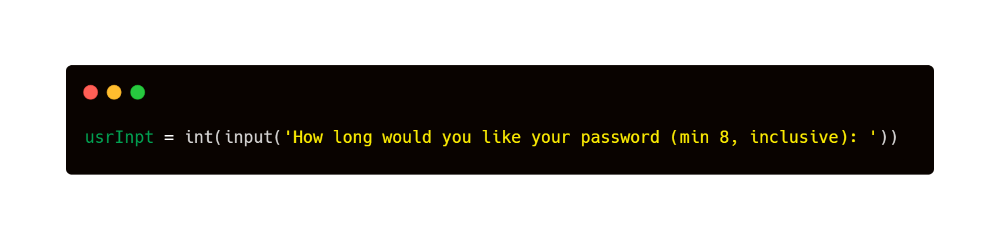

# Password Generator

This code generates a random and secure password of specified length. It includes a combination of lowercase letters, uppercase letters, symbols, and numbers in a random order, ensuring that the password is strong and difficult to guess. The password is generated by shuffling and reversing the combination of elements, providing an added layer of security.

## Usage

The length of the password must be specified by the user and it must be a minimum of 8 characters long.

 
To generate a password, call the generate() function and pass in the desired password length as an argument.

